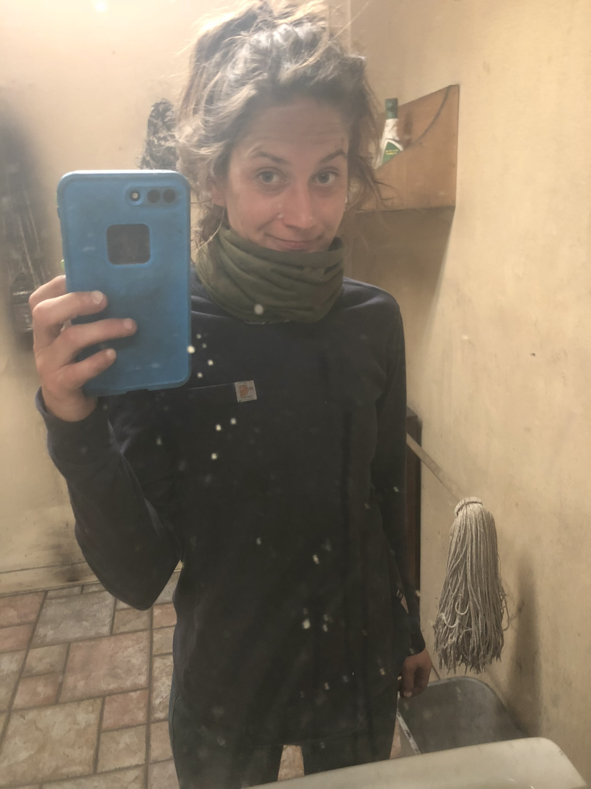

| First Header | Hero Content Navbar |
| ------------ | ------------------- |
| header logo  | Hero Content |
|About Me| Bio|
|Portfolio| Content |
|Social Media| contact |

## Logo

### Table of Contents
* [about-me](#about-me)
* [portfolio](#portfolio)
* [social-media](#social-media)
* [contact-info](#contact-info)

          <h1>
      Andrea Glade
      

        <video height="200px" width="201px" controls>
          <source src="IMG_1700.TRIM.mov" type="video/mp4">
          <source src="movie.ogg" type="video/ogg">
          Your browser does not support the video tag.
        </video>
      

    </h1>
      <nav class=navBar>
        <ul class=navBarLinks>
            
          <li>
            <a href="#about-Me">About Me</a>
          </li>
         
          <li>
            <a href="#portfolio">Portfolio</a>
          </li>
         
          <li>
            <a href="#social-media">Contact</a>
          </li>
         
          <li>
              <a href="#contact-info">Say Hi</a>
          </li>
         
          <li class="video">
            <video height="237px" width="221px" controls>
              <source src="IMG_9448 (1).MOV" type="video/mp4">
              <source src="movie.ogg" type="video/ogg">
              Your browser does not support the video tag.
            </video>
        </ul>
      </nav>
  </header>
  <section id="about-me" class="about-me">
    

      
      

        Hi! My name is Andrea,  
        check out my Github and Linkdin,  
        and reach out if you'd like a quote!
      

    

  </section>
  <section id="portfolio" class= "portfolio">
    

         Portfolio
    

    <video height="375px" width="401px" controls>
      <source src="IMG_1713.mov" type="video/mp4">
      <source src="movie.ogg" type="video/ogg">
      Your browser does not support the video tag.
    </video>
</section>
  <section id="social-media">
    

      <h3 class="social-media">Social Media</h3>
      

        <ul>
          <a href="https://github.com/AnnieGlade4327">Github</a>
        </ul>
        <ul>
          <a href="https://www.linkedin.com/in/annie-glade-909879199/">LinkedIn</a>
        </ul>
        <ul>
          <a href="annie.glade4327@gmail.com">Send email</a>
        </ul>
        <ul>
          <a href="tel: +8018888888">+80 188 88888 </a>
        </ul>
      

    

  </section>
  <section id="contact-info">
    

    <section id="say-hi">
      

        <h3>send me a message!</h3>
        

          Fill out the form to request a quote, 

        <form>
          <label for="name"> Enter preferred name:</label>
          <input type="text" placeholder="Your Name" name="name" id="name" class="form-input" />
          <label for="email">Enter email address:</label>
          <input type="text" placeholder="email" name="email" id="email" class="form-input" />
          <label for="mobile">Enter your telephone number:</label>
          <input type="text" placeholder="mobile" name="mobile" id="mobile" class="form-input" />
          <label for="quote">Questions/Request a Quote:</label>
          <input type="text" placeholder="Request a quote" name="quote" id="quote" class="form-input" />
          <button type="submit" class="button">
            send
          </button>
        </form>
    </section>
    

    

  </section>
   